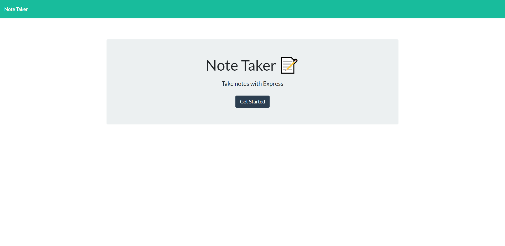
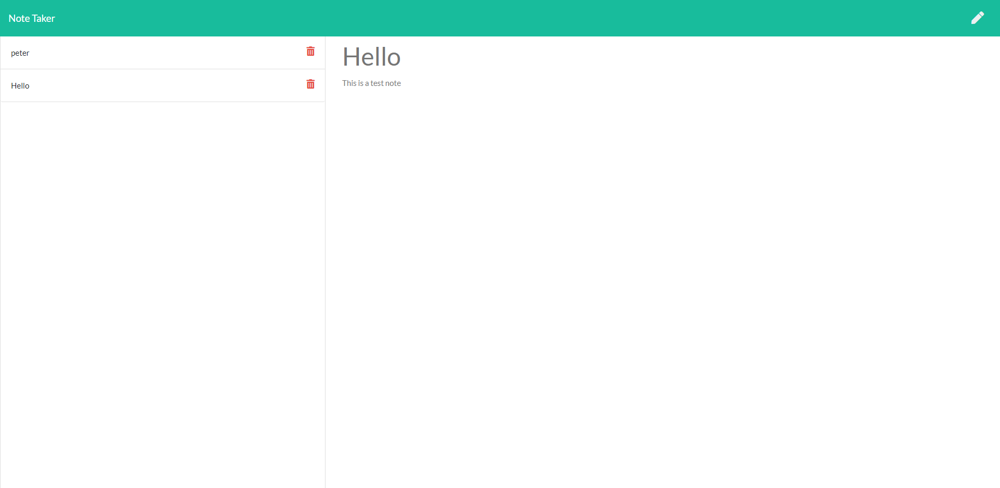

# Note Taker

## Description

A simple Note Taker application that allows you to type in a note and save it to the database or delete it from the database.

## Usage

As a user I want to be able to use the Note Taker app to create, view and delete notes.

- When loading the notes page, you should be prompted with all of the notes that are stored in the Database;
- When typing a title for your note AND text for the note itself, a button to save the note will appear;
- When the Save button will be clicked, your new note will be saved into the data base and displayed on the right hand side of the screen;
- For each note in the database, you will have a button with a delete icon;
- When that icon is clicked, that respective note will be deleted; **(_WIP_)**

## Screenshot of the Working Application

Landing Page 

Notes Page 

## Link to GitHub repository

You can view the GitHub repository by clicking [here](https://github.com/ttudorandrei/note-taker)

## Link to deployed application

You can view the deployed application by clicking [here](https://note-taker-0432678.herokuapp.com/)
